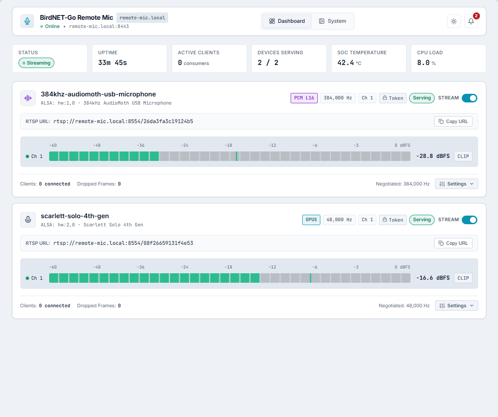
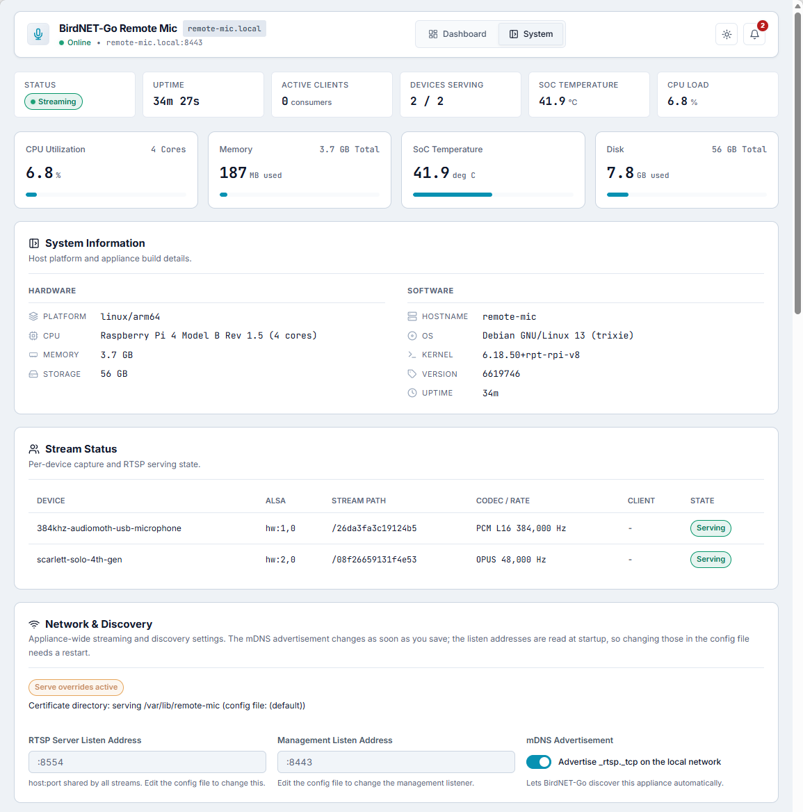

# BirdNET-Go Remote Mic

[](https://github.com/tphakala/birdnet-go-remote-mic/actions/workflows/ci.yml)
[](https://codecov.io/gh/tphakala/birdnet-go-remote-mic)
[](go.mod)
[](https://scorecard.dev/viewer/?uri=github.com/tphakala/birdnet-go-remote-mic)
[](LICENSE)
[](https://github.com/sponsors/tphakala)

**Stream a local microphone to [BirdNET-Go](https://github.com/tphakala/birdnet-go)
over your network.** One pure-Go binary captures audio from a microphone
attached to a small Linux host, encodes it (Opus for birdsong, raw PCM for
ultrasonic recording), and publishes it as a standard RTSP/RTP stream. Point
BirdNET-Go at that stream and it ingests the audio like any other RTSP source.

There is nothing else to run: no ffmpeg, no separate media server, no glue
scripts. Install the binary, enable a capture device from the built-in web UI,
and add the stream's RTSP URL to BirdNET-Go. It runs happily on a Raspberry Pi
Zero 2 W (arm64) or an older 32-bit Pi (arm), the same class of hardware
BirdNET-Go itself runs on.



## What it does

- **Captures** audio from any number of local devices (USB or I2S) with no
  transcoding glue, one binary per host serving one RTSP stream per device.
  Devices that expose only 24-bit or 32-bit PCM (such as many USB microphones)
  are captured at their native depth and reduced to 16-bit for the stream.
- **Encodes** for two jobs over one protocol:
  - *Normal audio* uses Opus at 48 kHz, mono or stereo, low bandwidth for
    ordinary birdsong.
  - *Ultrasonic* uses raw PCM (L16) at high sample rates (up to 256 or 384 kHz)
    for bat detection, where no lossy codec can carry the signal. On a LAN the
    uncompressed bandwidth is a non-issue (~4 Mbit/s at 256 kHz mono).
- **Streams** over a self-implemented RTSP/RTP server, TCP-interleaved by
  default so the audio arrives lossless and firewall-friendly. ffmpeg, VLC, and
  BirdNET-Go's own ingest client all play it.
- **Advertises itself** on the LAN over mDNS / DNS-SD with everything needed to
  adopt the stream. Automatic discovery on the BirdNET-Go side is still to come,
  so for now you add the stream to BirdNET-Go by its RTSP URL.
- **Manages itself** through a built-in HTTPS web UI: enable devices, watch live
  levels, copy RTSP URLs, and set an access token, with no config-file editing.

## Install

Prebuilt releases for Linux **amd64**, **arm64**, and **32-bit arm** (ARMv6,
for older Raspberry Pis) are on the
[releases page](https://github.com/tphakala/birdnet-go-remote-mic/releases).
Every method below installs the same `remote-mic` binary; pick whichever suits
the host.

### Homebrew (Linux)

```sh
brew install tphakala/tap/birdnet-go-remote-mic
```

Upgrade later with `brew upgrade birdnet-go-remote-mic`.

### Debian, Ubuntu, Raspberry Pi OS (.deb)

Download the `.deb` for your architecture from the
[latest release](https://github.com/tphakala/birdnet-go-remote-mic/releases/latest)
and install it:

```sh
sudo apt install ./birdnet-go-remote-mic_*_linux_arm64.deb   # or _amd64
```

The package installs `/usr/bin/remote-mic` and starts nothing on its own. Set up
the service when you are ready (see [Run at boot](#run-at-boot-systemd-service)).

### Tarball

Download the `.tar.gz` for your architecture, unpack it, and put the binary on
your PATH:

```sh
tar xzf birdnet-go-remote-mic_*_linux_arm64.tar.gz
sudo install -m 0755 remote-mic /usr/local/bin/remote-mic
```

### Build from source

Requires Go (version in `go.mod`) and Node (for the web UI):

```sh
git clone https://github.com/tphakala/birdnet-go-remote-mic
cd birdnet-go-remote-mic
task build:arm64     # or build:amd64, or build:arm for 32-bit Pis
# the binary lands in bin/remote-mic-<arch>
```

Once the binary is installed, [run it at boot](#run-at-boot-systemd-service)
with `sudo remote-mic service install`, then open the web UI and enable a
device.

## Web UI

A built-in HTTPS management UI (default `:8443`) runs alongside the streams. The
**Dashboard** (shown above) lists every capture device with live per-channel
level meters, stream state, negotiated rate and channel count, the RTSP URL with
one-click copy, and dropped-frame counters. Its **Available Devices** list
enumerates capture hardware on the host that is not streaming yet, so you enable
a device straight from the browser with no config-file editing.



The **System** tab covers host information (platform, CPU, memory, temperature,
disk), per-device stream status, the network and discovery settings, and the
Access Control card for setting or rotating the shared access token.

## Discovery

Each configured device is advertised as its own mDNS/DNS-SD `_rtsp._tcp`
instance (so `avahi-browse -r _rtsp._tcp` and `dns-sd -B _rtsp._tcp` see them
all), with TXT records that carry everything needed to adopt the stream:
`codec`, `rate`, `ch`, `path`, `auth` (`token` when an access token is required,
else `none`), and a `txtvers`. It sends goodbye packets on shutdown so stale entries
clear promptly. When a config save starts, stops, or restarts a device, a
hardware-change retry starts one, or a device restarted by the automatic retry
counts as recovered (it has kept serving for 30 seconds, see Multi-device
behaviour), the whole advertisement is rebuilt, because
the responder cannot retire a single service; a retry or hardware change that
would advertise exactly what is already advertised skips the rebuild. A
device that dies mid-run stays advertised until the next rebuild (see
Multi-device behaviour). If the responder cannot start (its socket cannot be
opened, or registering a name fails), it is retried with a growing delay
(5 s, 30 s, 2 min, then every 5 minutes) until it runs. Automatic
discovery on the BirdNET-Go side is not available yet, so for now you add each
mic in BirdNET-Go by its `host:port` plus path; the advertisement is already in
place for when that support lands. Set `discovery.enabled: false` to turn the
advertisement off.

## Usage

The appliance is a single binary. Apart from `serve` and `version`, commands
are grouped by what they act on (`remote-mic <noun> <verb>`):

```bash
remote-mic                  # capture and serve (the default; same as `serve`)
remote-mic devices list     # enumerate capture devices (id, address, label)
remote-mic token generate   # create the access token, save it, print it
remote-mic token get        # print the current access token
remote-mic service install  # install and enable the systemd service (run at boot)
remote-mic version
```

`remote-mic help` lists the commands; add `-h` to `serve` or to a `token` or
`devices` command for its flags. Commands that read the config take
`--config`, which defaults to the `REMOTEMIC_CONFIG` environment variable and
then to `config.yaml` in the working directory. Set `REMOTEMIC_CONFIG` in the
service unit and in your shell profile on the appliance, and every command
finds the same file without `--config`.

### Run at boot (systemd service)

To run the appliance at boot, install it as a systemd service:

```bash
sudo remote-mic service install
```

This creates a dedicated `remote-mic` system user (added to the `audio` group
for device access), copies the binary to `/usr/local/bin/remote-mic`, writes and
enables `/etc/systemd/system/remote-mic.service`, and starts it. The service
reads its config from `/etc/remote-mic/config.yaml` and keeps its management
certificate under `/var/lib/remote-mic`, both owned by the service user. There
is no config file on a fresh install, so open the web UI and enable a device;
the zero-config first start writes the file for you.

Run it as a normal user: `install` re-runs itself under `sudo` and prompts for
your password for the privileged steps. Flags override the defaults (`--user`,
`--config`, `--state-dir`, `--bin-path`, and `--no-start` to enable without
starting). Manage it afterwards:

```bash
remote-mic service status                    # enabled at boot? running now?
sudo remote-mic service uninstall            # stop, disable, remove the unit (keeps config)
sudo remote-mic service uninstall --purge    # also remove config, state, binary, and user
```

The installer targets Debian-family systems (Debian, Ubuntu, Raspberry Pi OS)
and works on any systemd host.

### Zero-config first start

With no config file, the appliance boots with defaults and no devices, so the
web UI comes up empty. Open it and the **Available Devices** list shows the
host's capture hardware; enable a device there and the appliance writes the
config file for you. Nothing to hand-edit.

### Config file

One binary per host serves any number of capture devices: each entry in the
`devices:` list gets its own RTSP path on the shared `listen` port and its own
mDNS instance. To configure it by hand instead of using the web UI:

```yaml
listen: ":8554"
discovery:
  enabled: true
auth:
  token: ""              # set a token to require credentials (see Authentication)
devices:
  - name: garden-mic       # unique instance name; also the mDNS label
    device: "usb:1235:8218:s=S1A2B3C4:if=0,0"   # from `remote-mic devices list`
    path: /garden          # unique RTSP path; defaults to /stream
    mode: opus             # "opus" (48 kHz, mono or stereo) or "pcm" (L16, any rate, ultrasonic)
    rate: 48000
    channels: [1]
    format: s16
    opus:
      bitrate: 64000
  - name: ultrasonic-mic   # add as many devices as the hardware supports
    device: "usb:16d0:06f3:p=0000:01:00.0-1.1:if=0,0"
    path: /bat
    mode: pcm
    rate: 256000
    channels: [1]
    format: s16
```

A device's `device` value names the physical hardware, not its ALSA card
number. The kernel numbers cards in probe order, so `hw:3,0` can be a different
microphone after a reboot or a replug. Copy the id from `remote-mic devices list`
(or let the web UI write it):

- `usb:<vendor>:<product>:s=<serial>:if=<interface>,<device>` names a USB unit
  by its serial and follows it to any port.
- `usb:<vendor>:<product>:p=<port>:if=<interface>,<device>` names the physical
  port a USB device is plugged into. It is used for a device with no serial, and
  for identical units that report the same serial.
- `hw:CARD=<card id>,DEV=<device>` names a built-in or virtual card by its
  kernel card id.

A card-index id such as `hw:1,0` still works (offered when the host has no
stable form: no sysfs in a minimal container, or a USB device with neither a
serial nor a derivable port), but the web UI and `--check` flag it. A device
whose id matches nothing is reported as not connected, and one whose id matches
two units (identical devices sharing a serial) as ambiguous; the appliance never
opens a different device in its place. Give each of the two units its own port
id, not just one; `remote-mic devices list`, the web UI, and the ambiguity error
(shown by the web UI and `--check`) all name the port id to use.

A name, id or path set through the web UI or the management API is limited to
128 characters for a device name and a stream path, and 2048 for a device id. A
config file that exceeds them still loads, so an upgrade never stops an
appliance from starting, and a value already in the file does not block other
changes; only a new over-long value is refused. An mDNS service name is one
DNS label (63 bytes), and the appliance keeps 6 of those free for the
` (N)` suffix the responder adds when another host already uses the name, so
it advertises at most 57 bytes: a longer device name is cut, keeping the
stream path it gets for a device with several streams (a path that alone is
longer is cut too). Names that would then be the same (compared without
ASCII case, as DNS compares them) are kept apart: the later one in config order
advertises with a ` #2` suffix (` #3` and so on for more), its name cut
further to make room.

Serve flags override the loaded config for that run (precedence: flag over
config over default), which is handy for relocating ports on a host where the
defaults are taken:

```bash
remote-mic --config config.yaml --listen :8554 --mgmt-listen :8443
remote-mic --config config.yaml --check   # validate config, show what each device id resolves to, then exit
```

Then pull each stream at `rtsp://<host>:8554<path>`, for example
`rtsp://<host>:8554/garden`. A single-device config is just a one-entry list.

## Authentication

By default the appliance is open: anyone on the network can pull the streams
and use the management API and web UI. Set a shared access token to require
credentials everywhere at once.

The quickest way is `token generate`: it creates a strong token, writes it
into the config, and prints it.

```bash
remote-mic token generate           # create, save, and print a token
remote-mic token generate --force   # rotate: replace the existing token
remote-mic token get                # print the current token (for the web UI login)
remote-mic token set < token.txt    # use a token of your own (prompts when run in a terminal)
remote-mic token clear              # remove the token and return to open access
```

`token get` prints only the token, so `TOKEN=$(remote-mic token get)` works in
scripts. `token set` never takes the token as an argument, which would leave it
in shell history and the process list: it reads stdin, or prompts twice without
echo in a terminal. `token clear` asks for confirmation in a terminal and needs
`--yes` otherwise.

`generate`, `set`, and `clear` work whether or not the appliance is running.
While it runs, they send the change through its management API, so it applies
immediately, exactly like the web UI's Access Control card. A running appliance
holds a lock file beside its config (`config.yaml.lock`) that records where the
API listens. When the appliance is stopped, the commands edit the config file
and the change applies at the next start. An appliance running without its
management API has no config writer, so the commands edit the file too and the
running process keeps its current token until it restarts. An API that failed
to start (for example on a certificate it could not read), or whose listener
stopped while running, is retried in the background, 30 seconds after the
failure and then less often, up to every 10 minutes (an API that stops again
within 10 minutes of coming back resumes that backoff rather than starting
it over); each attempt applies an edited config file, even one that still
cannot bring the API up, and binds the `management.listen` address and reads
the certificate from the `cert_dir` that file sets, so fixing a port in use
or a certificate path in the file needs no restart. A file that sets
`management.enabled: false` ends the retry. Serve flags (`--mgmt-listen`,
`--cert-dir`, `--management`) still override the file. A command run while
the appliance is still starting up, before it has published where its API
listens, while one of those background attempts runs, or in the seconds
after its API stops while that API drains (up to about 10 seconds with a
browser open), asks you to retry in a few seconds. The config is written 0600, so run
the commands as the account the appliance runs as.

You can also set it by hand:

```yaml
auth:
  token: "<replace-with-your-own>"   # 12-128 characters of letters, digits, . _ ~ -
```

The angle-bracket placeholder deliberately fails validation (angle brackets are
outside the allowed set), so a half-edited config refuses to start rather than
serving on a non-secret. The web UI does it for you too: go to System, open the
Access Control card, and press Generate then Save. The change applies
immediately, no restart: the running RTSP server and API start asking for the
token on the next request, and the mDNS TXT record switches to `auth=token`.
Clearing the token returns the appliance to open access. The UI warns with a
banner while access is open.

One token gates both surfaces:

- Management API and web UI: send it as a bearer credential. `/api/v1/healthz`
  stays open for liveness checks and the web UI's own static files stay open so
  the login screen can load; every other `/api/v1` route answers 401 without it.

  ```bash
  curl --cacert mgmt-cert.pem -H "Authorization: Bearer <your-token>" https://<host>:8443/api/v1/status
  ```

  The appliance generates its own certificate (`mgmt-cert.pem`, beside the
  config file by default), so copy that file to the client and verify against
  it. Reach the appliance by IP or by its bare hostname: the certificate covers
  those, not the `.local` name mDNS advertises, so a `.local` URL fails the name
  check. `curl -k` works with any host form, but it skips verification
  entirely, which lets anything on the network impersonate the appliance and
  collect the token: keep it for local testing only.

- RTSP stream: standard Digest authentication with the token as the password
  and any username (`mic` by convention), so the usual URL form works in
  BirdNET-Go, ffmpeg, VLC and GStreamer:

  ```bash
  ffprobe -rtsp_transport tcp rtsp://mic:<your-token>@<host>:8554/garden
  ```

  On the Dashboard, a device card's Copy URL button includes the credentials
  when a token is set and this browser is signed in.

Notes: enabling a token, or rotating one, stops existing streams. A connection
that is actively receiving audio is dropped as soon as the change lands, within
a frame or so; the server tears it down rather than re-authenticating it in
place, so the client has to reconnect with the current token. BirdNET-Go retries
on its own, while ffmpeg and VLC exit and need restarting with the new
credentials in their URL. A connection that is not currently streaming, one
still negotiating or set up but idle, is instead re-challenged on its next
request, which for a mostly-idle client is when its keepalive next falls due: up
to about 30 seconds with the default 60 second session timeout, measured with
ffmpeg. A client that does not present the current token is disconnected and its
stream slot released. Restart the appliance if you need every idle session cut
at once. One exception: a management event stream (GET /events) opened before
the change keeps running, because the bearer token is checked once when the
stream starts, not per event.
As for what crosses the wire: the bearer token rides inside TLS (the API is
HTTPS with a self-signed certificate), and Digest never sends the token at all,
only an MD5 response over it. That MD5 exchange travels over plain TCP, so it is
brute-forceable offline, and the audio itself is unencrypted. This is the threat
model of a home-network appliance: the token keeps casual listeners and stray
clients out, it is not a substitute for network isolation on a hostile network.

## Debugging

Play or inspect the stream with standard tools (TCP-interleaved transport):

```bash
ffprobe -rtsp_transport tcp rtsp://<host>:8554/stream
ffplay  -rtsp_transport tcp rtsp://<host>:8554/stream
ffmpeg  -rtsp_transport tcp -i rtsp://<host>:8554/stream -t 5 out.wav
```

For a local end-to-end check without hardware, use the ALSA loopback
(`snd-aloop`): play a tone into `hw:Loopback,0` and point a device's
`device` at the capture side `hw:CARD=Loopback,DEV=1`.

### Multi-device behaviour

- A device that fails to open, is not connected, or whose id is ambiguous is
  logged and skipped. While the management API is serving (it is enabled by
  default) the process stays up so its status API keeps reporting every
  skipped device and its open error, even when no device opens at all. With
  management disabled, or while its API is down (it has not come up yet, or
  it stopped and is being retried), there is nothing
  to keep alive, so a total open failure exits nonzero and lets a supervisor
  restart the process.
- A device that dies mid-run (a USB unplug) is retired: its path returns 404
  while the other devices keep serving. The appliance rescans the host's
  capture hardware every 15 seconds, and when the set of devices changes it
  restarts every device that is down and configured by a stable id, so a
  replugged device serves again on the same path even if it came back under a
  different card number. A device pinned to a card index (`hw:1,0`) is not
  restarted this way, because that index can now name a different microphone; it
  waits for a config save, which also restarts a down device of either kind.
  While the management API is serving the process stays up after the
  last device dies, so the failure stays inspectable over the API; otherwise
  it exits once every device has stopped. The appliance retakes that decision
  whenever a device's capture ends and whenever the API stops being retried
  (the config file disabled it), so it never stays up with nothing serving and
  nothing to inspect. An API that stops at runtime does not end the process by
  itself: it is retried in process, which keeps the event history.
  A device that dies mid-run stays in the mDNS advertisement until it is next
  rebuilt (a config save, a hardware-change retry that starts a device, an
  automatic retry once it counts as recovered, or process exit), because
  the dnssd responder cannot retire a single service, so a discoverer that picks
  it up meanwhile gets 404.
- A device that is still plugged in but down (it could not be opened, for
  example because another process holds it, or its capture died with a driver
  or encoder error) is retried on its own with a growing delay: 5 s, 10 s,
  30 s, 1 min, 2 min, then every 5 minutes, while the process is up (with
  management disabled the process exits once nothing serves, as above). Its
  error notification stays raised across attempts and clears once a retried
  restart has kept serving for 30 seconds, so a device that keeps failing is
  reported once, not on every attempt. A stream encodes only while a client
  plays it, so after an encoder error on a stream the notification clears only
  once a client has played that stream on the restarted device and encoding
  worked, and the device has then kept serving for 30 seconds; until then it
  stays raised while the device serves. Its RTSP path serves again as soon as
  the restart opens it. A config save restarts it at once, starts the delays
  over, and clears the notification as soon as it opens (except after an
  encoder error, below). Plugging or unplugging another device, or
  replugging the failed device itself, restarts it at once too. After an
  encoder error, though, a hotplug or a config save that
  leaves the device's settings unchanged cannot have fixed the encoder, so
  that restart still has to prove the stream's encoder before the
  notification clears; only a save that changes the device's capture or
  stream settings clears it as soon as the device opens. A card-index device
  is not retried this way either.
- Practical limits are hardware, not software: ALSA `hw:` devices are
  single-client (the config rejects a device id used twice, and a second entry
  that resolves to hardware another entry already captures from is skipped), USB isochronous
  bandwidth is shared per controller (watch for xruns when several high-rate
  or ultrasonic mics share one hub), and independent devices drift relative to
  each other over time (each stream is honest to its own capture clock).

## Development

```bash
task check   # build (amd64 + arm64 + arm, CGO off), vet (4 arches), lint, gofmt, race tests
```

The web UI is compiled TypeScript embedded via `go:embed`; `web/dist` is
generated, not committed. `task` rebuilds it before every build, so `task check`
and `task build` work from a clean checkout. A bare `go build ./...` or
`go test ./...` outside `task` needs those assets present: run `task web:build`
first, or pass `-tags skipfrontend` to compile the Go code against a stub UI
(what the CI Go jobs do).

Tagged releases (`v*`) are built by GoReleaser (`.goreleaser.yaml`): Linux
amd64/arm64 tarballs and `.deb` packages, plus the Homebrew formula pushed to
[tphakala/homebrew-tap](https://github.com/tphakala/homebrew-tap).

## Design principles

- Pure Go, zero CGO, single static binary. Linux on 64-bit arm64 (Pi Zero 2 W
  and up) and 32-bit arm (older Pis, built with GOARM=6 for ARMv6 reach); amd64 for
  development.
- Reuse the existing [go-audio-stream](https://github.com/tphakala/go-audio-stream)
  transport, codec, and RTP machinery rather than reinventing it. The stream
  primitives are the inverse of what that library already does on ingest.
- Simple install, mirroring how BirdNET-Go deploys on the same hardware.

## License

MIT. See [LICENSE](LICENSE).
